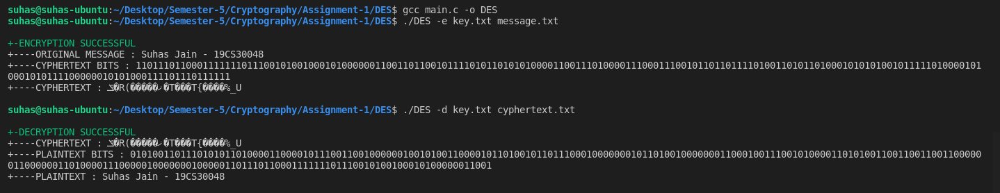

# DES

Name - Suhas Jain   
Roll no. - 19CS30048  
Implementation of the DES encryption algorithm in C. 

## File Description 
**message.txt** : This file contains the message that needs to be sent.  
**key.txt** : This file contains any 8 character key.  
**cyphertext.txt** : This file contains the message after it has been encrypted.  
**plaintext.txt** This file contains the message after it has been decrypted.

## Intsalling

- Go to the main.c folder
`$cd /path/to/main.c`

- Compile main.c using GCC
`$gcc main.c -o DES`

## Running DES
  
  
  - To encrypt
    
    - Go to the DES executale path:
    
      `$cd /path/to/DESexecutable`
    
    - Run the compiled DES program:
      
      `$./DES -e KEY_FILE(key.txt) MESSAGE_FILE(message.txt)`
      
  - To decrypt
    
    - Go to the DES executale path:
    
      `$cd /path/to/DESexecutable`
    
    - Run the compiled DES program:
    
      `$./DES -d KEY_FILE(key.txt) CYPHERTEXT_FILE(cyphertext.txt)`

## Sample Run
