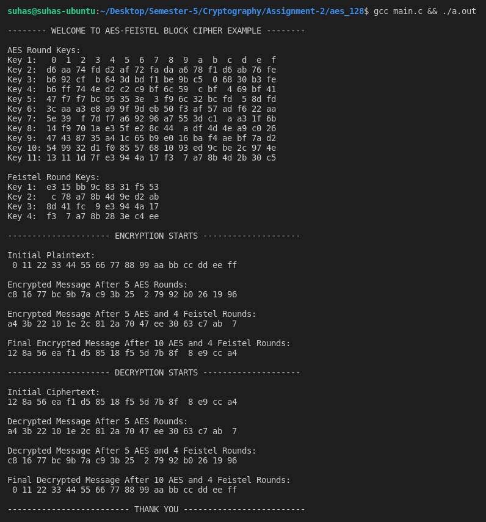

# AES-FEISTEL BLOCK CIPHER 
This code is written as a part of Assignment-2 of Cryptography and Network Security (MA61027) course.  
**Author  : Suhas Jain**   
**Roll No.: 19CS30048**
</br>
</br>
This encryption algorithm consists of a block cipher which first encrypts via 5 rounds of AES encryption, then 4 rounds of Feistel encryption and finally 5 more rounds of AES encryption. Decryption is also carried out in a similar fashion.  

## Important Functions

```C
/**
 * Key schedule for AES-128 and 4 round Feistel cipher 
 * [Input]  key:         16 bytes of master keys
 * [Output] aeskeys:     176 bytes of round keys for AES decryption and encryption 
 * [Output] feistelkeys: 32 bytes of round keys for Feistel decryption and encryption
 */
void key_schedule(const uint8_t *key, uint8_t *aeskeys, uint8_t *feistelkeys) 

/*
 * Encryption Function. The length of plain and cipher should be one block (16 bytes).
 * [Input]  aeskeys:     round keys for AES encryption
 * [Input]  feistelkeys: round keys for feistel encryption
 * [Output] ciphertext:  cipher text
 * [Input]  plaintext:   plain text
 */
void block_encrypt(const uint8_t *aeskeys, const uint8_t *feistalkeys, const uint8_t *ciphertext, uint8_t *plaintext);

/*
 * Decryption Function. The length of plain and cipher should be one block (16 bytes).
 * [Input]  aeskeys:     round keys for AES decryption
 * [Input]  feistelkeys: round keys for feistel decryption
 * [Input]  ciphertext:  cipher text
 * [Output] plaintext:   plain text
 */
void block_decrypt(const uint8_t *aeskeys, const uint8_t *feistalkeys, const uint8_t *ciphertext, uint8_t *plaintext);
```

## Compile Instructions 
```sh
gcc main.c && ./a.out
```
**To change the plain text and cipher text, and run on other examples, manually change the plaintext and key arrays in main.c**

## Dependencies

+ The code is written in standard C (only GCC compiler installation required)
+ No dependencies of other libraries

## Test Run
Below attached is a photo of an example run of the program.   

